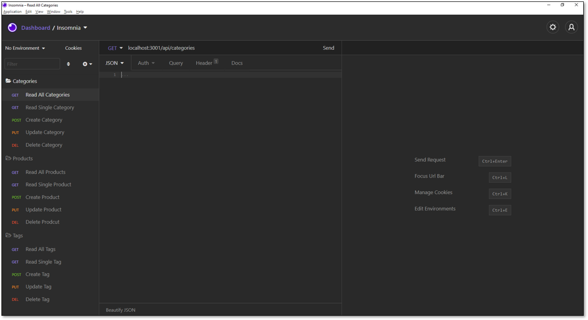

# E-Commerce
```
Back-end application based on Object-Relational Mapping (ORM)
```

## User Story

```md
AS A manager at an internet retail company
I WANT a back end for my e-commerce website that uses the latest technologies
SO THAT my company can compete with other e-commerce companies
```

## Acceptance Criteria

```md
GIVEN a functional Express.js API
WHEN I add my database name, MySQL username, and MySQL password to an environment variable file
THEN I am able to connect to a database using Sequelize
WHEN I enter schema and seed commands
THEN a development database is created and is seeded with test data
WHEN I enter the command to invoke the application
THEN my server is started and the Sequelize models are synced to the MySQL database
WHEN I open API GET routes in Insomnia Core for categories, products, or tags
THEN the data for each of these routes is displayed in a formatted JSON
WHEN I test API POST, PUT, and DELETE routes in Insomnia Core
THEN I am able to successfully create, update, and delete data in my database
```

## Terminal Commands for dependencies
  * npm i
  * npm i [dotenv](https://www.npmjs.com/package/dotenv)
  * npm i [express](https://www.npmjs.com/package/express)
  * npm i [mysql2](https://www.npmjs.com/package/mysql2)
  * npm i [sequelize](https://www.npmjs.com/package/sequelize)

## How application was deployed
  1. Run 'npm i' in the terminal to initite the project as npm project.
  2. Add all given assets and files.
  3. Run 'npm i [dotenv, express, mysql2 and sequelize]' to update the dependencies.
  4. Add login credentials to .env and rename the file.
  5. Write models for Category, Product, ProductTag and Tag to create [association](#associations).
  6. Copy paste the database file to mysql workbench and create a blank database.
  7. Run 'npm run seed' to fetch the given data.
  8. Check if the data is seeded in workbench.
  9. Write api route for Category, Product and Tag.
  10. Run 'npm start' to connect to server.
  11. In Insomnia core, create folder environment for each methods that is being tested.
  12. Deploy each methods by clicking the method button in Insomnia core.

### Associations

* `Product` belongs to `Category`, and `Category` has many `Product` models, as a category can have multiple products but a product can only belong to one category.
* `Product` belongs to many `Tag` models, and `Tag` belongs to many `Product` models. Allow products to have multiple tags and tags to have many products by using the `ProductTag` through model.

## Repository Link
https://github.com/marora7926/e-commerce

## Screenshots:


## Access Walkthrough Video here
[Employee Management System Walkthrough Video](https://cloudstor.aarnet.edu.au/plus/s/xxxx)

### Walkthrough Video demonstrating:
* the overall functionality of the e-commerce back end
* that all technical acceptance criteria has been met
* how schema from the MySQL shell was created
* how the database from the command line was seeded
* how the application’s server started
* GET routes for all categories, all products, and all tags being tested in Insomnia Core
* GET routes for a single category, a single product, and a single tag being tested in Insomnia Core, and 
* POST, PUT, and DELETE routes for categories, products, and tags being tested in Insomnia Core

- - -
© 2021 Mohit Arora. Confidential and Proprietary. All Rights Reserved.